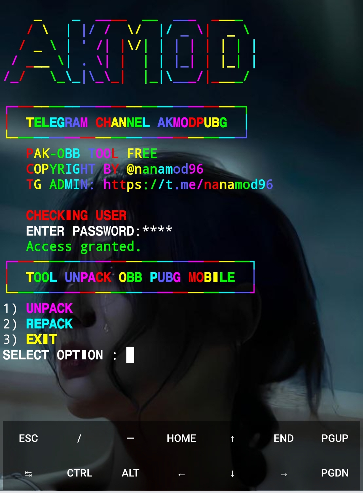

# UNPACK OBB PUBG MOBILE


## Enter This Command:
```
pkg update && pkg upgrade
```
```
pkg install git
```
```
termux-setup-storage
```
## Clone this repository
```
git clone https://github.com/nanamod96/AKMODPUBG.git
```
```
cd AKMODPUBG
```
```
chmod +x setup nanamod96
```
```
./setup
```
## Note: Next time when entering the tool, type "obb" the tool will start automatically.
